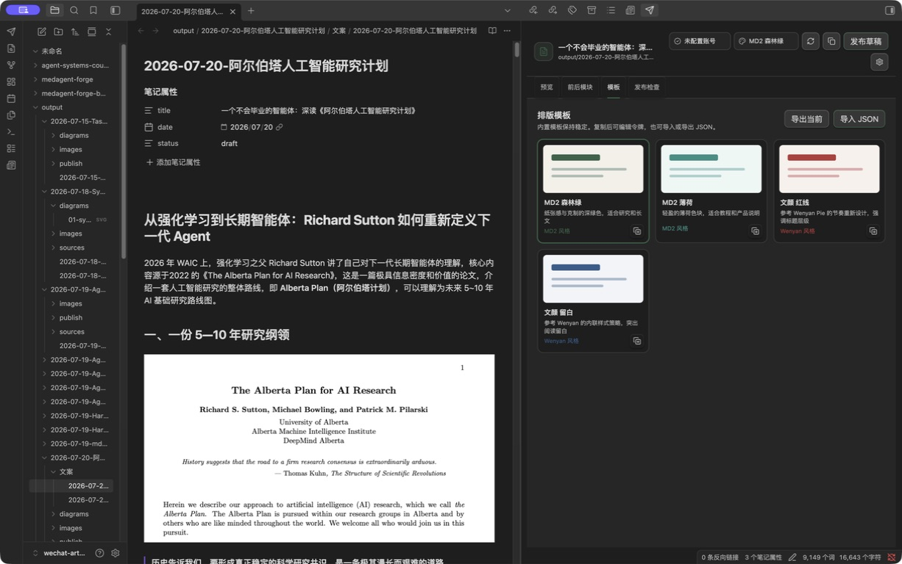
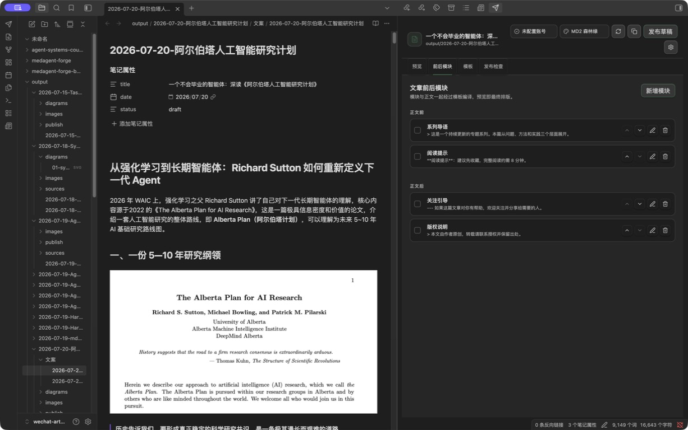

# WeChat Obsidian Publisher

在 Obsidian 内完成微信公众号文章预览、前后模块编排、模板定制和草稿发布。


<details>
<summary>查看模板与前后模块面板</summary>





</details>

## 现在能做什么

- 在右侧工作台实时预览当前 Markdown 笔记，支持手机和桌面宽度。
- 内置 `MD2 森林绿`、`MD2 薄荷`、`文颜 红线`、`文颜 留白` 四套模板。
- 在正文前后添加、启用、排序和编辑 Markdown 内容模块。
- 复制任意内置模板后编辑 JSON 令牌，支持模板导入和导出。
- 解析代码块、KaTeX 公式、Mermaid 图表、表格和 Obsidian 本地图片。
- 将正文图片上传到微信，将封面上传为永久素材，再创建或更新草稿。
- 发布后自动调用 `draft/get` 回读标题与正文，回读一致才提示成功。
- 从现有 Wenyan 发布配置导入账号，AppSecret 会立即用系统加密服务重新保存。

## 与 Wenyan Core 的关系

本插件没有运行时或构建时的 `@wenyan-md/core` 依赖。渲染器参考了 Wenyan Core 的阶段化设计思想，自行实现：

```text
Markdown 解析 → 结构增强 → 模板令牌编译 → 图片改写 → 微信草稿
```

模板中的 “文颜” 表示视觉风格来源，不表示调用 Wenyan Core。相关归因见 [THIRD_PARTY_NOTICES.md](THIRD_PARTY_NOTICES.md)。

## 安装

### 从源码构建

```bash
npm install
npm run check
```

把以下文件复制到 Vault 的 `.obsidian/plugins/wechat-obsidian-publisher/`：

```text
main.js
manifest.json
styles.css
```

然后在 Obsidian 的第三方插件中启用 `WeChat Obsidian Publisher`。

## 快速配置

1. 打开插件设置。
2. 如果已经使用 `wechat-wenyan-publish`，点击“安全导入”。
3. 或手动填写公众号 AppID 和 AppSecret。
4. 设置默认作者和默认封面，也可以在文章 frontmatter 中逐篇覆盖。
5. 点击左侧功能区的发送图标，打开右侧工作台。

连接检查只获取 access token，不会创建或修改草稿。公众号后台仍需把当前公网 IP 加入白名单。

## 文章元数据

```yaml
---
title: 文章标题
author: 作者名
digest: 120 字以内摘要
cover: images/cover.png
source_url: https://example.com/original
---
```

如果没有填写 `cover`，发布时使用正文第一张图片。首次发布会创建草稿；同一路径再次发布会更新已关联草稿。

## 自定义模板

内置模板不会被直接改写。进入“模板”面板，点击复制图标生成用户模板，然后修改 JSON：

```json
{
  "id": "custom-example",
  "name": "我的模板",
  "description": "自定义样式",
  "source": "custom",
  "accent": "#356348",
  "canvas": "#f3f0e9",
  "styles": {
    "body": {
      "fontSize": "16px",
      "lineHeight": "1.85"
    },
    "h2": {
      "color": "#ffffff",
      "backgroundColor": "#356348"
    }
  }
}
```

保存时会过滤不适合公众号内联 HTML 的样式属性。用户模板保存在当前 Vault 的插件配置中，可以复制 JSON 到其他设备。

## 安全边界

- AppSecret 不写入仓库，也不出现在通知或错误日志中。
- macOS 上使用 Electron `safeStorage` 加密保存 AppSecret。
- 每次真实发布前都有确认窗口。
- 不会调用群发接口，只写入微信草稿箱。
- 未通过 `draft/get` 回读时不会报告发布成功。

## 开发

```bash
npm run dev
npm run test
npm run build
```

许可证：MIT。
