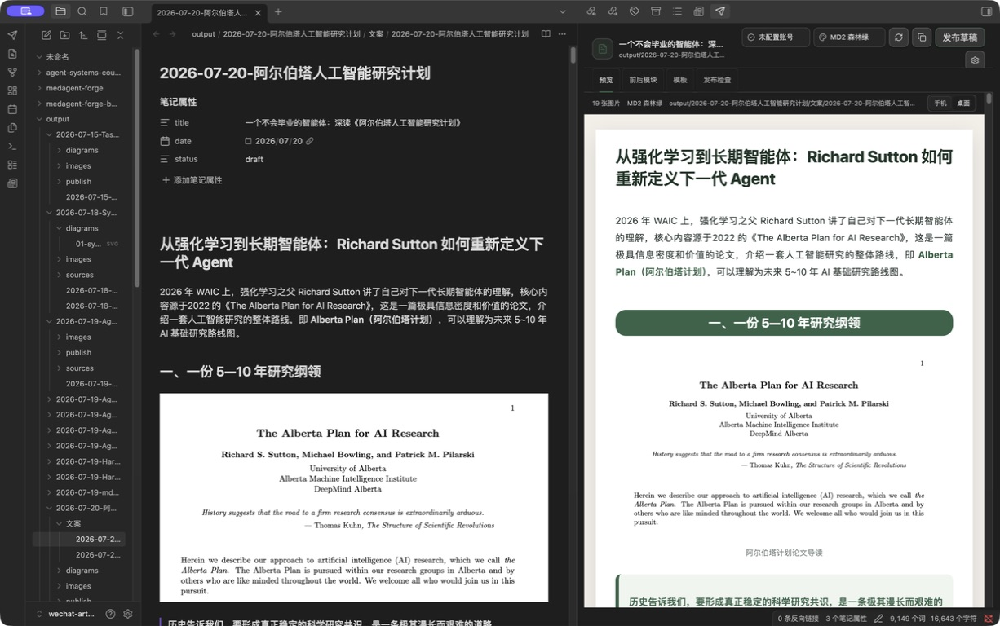
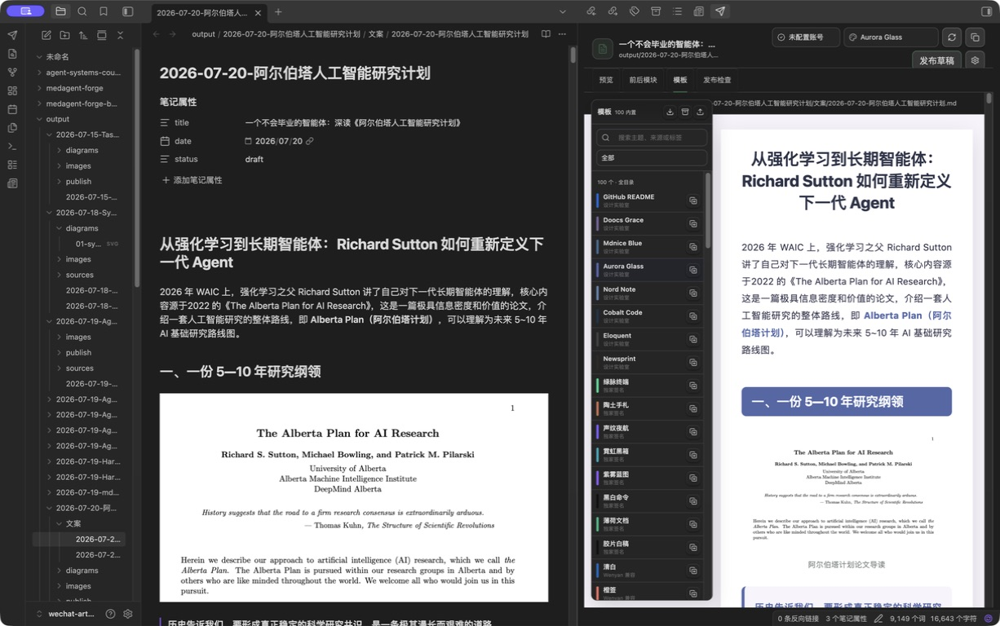
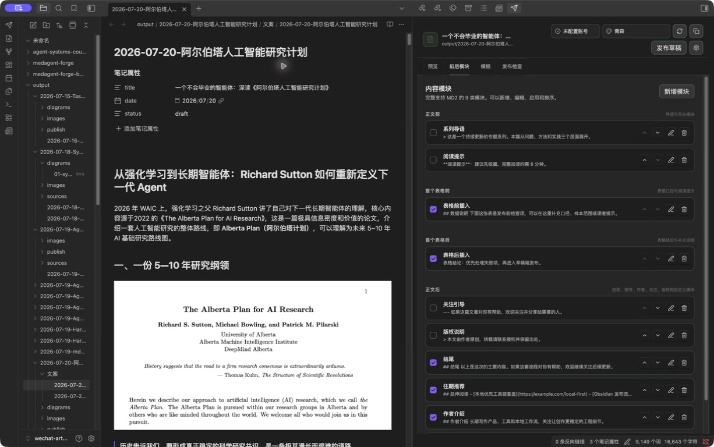

# WeChat Obsidian Publisher

在 Obsidian 内完成微信公众号文章预览、前后模块编排、模板定制和草稿发布。



<details>
<summary>查看模板与前后模块面板</summary>





</details>

## 现在能做什么

- 在右侧工作台实时预览当前 Markdown 笔记，支持手机和桌面宽度。
- 完整接入 md2wechat-publisher 的 100 套主题，包含 MD2 全量目录、Wenyan 兼容、WeMD、Doocs、Mdnice、NeuraPress 和编辑精选等分组。
- 模板选择采用左侧紧凑浮窗，主题以单色条呈现，切换时文章预览始终保留在右侧。
- 支持开头、表格前、表格后、结尾、往期推荐、作者介绍、关注卡片、版权声明和自定义模块共 9 类内容模块。
- 内容模块支持新增、编辑、启用、删除和分组排序，表格模块会围绕正文首个表格精确插入。
- 内置模板可复制为用户模板并立即编辑，支持单模板或模板包 JSON 文件导入，支持导出当前模板和全部用户模板。
- 解析代码块、KaTeX 公式、Mermaid 图表、表格和 Obsidian 本地图片。
- 将正文图片上传到微信，将封面上传为永久素材，再创建或更新草稿。
- 发布后自动调用 `draft/get` 回读标题与正文，回读一致才提示成功。
- 从现有 Wenyan 发布配置导入账号，AppSecret 会立即转存到 Obsidian 专用密钥存储，插件配置只保留引用。

## 与 Wenyan Core 的关系

本插件没有运行时或构建时的 `@wenyan-md/core` 依赖。渲染器参考了 Wenyan Core 的阶段化设计思想，自行实现：

```text
Markdown 解析 → 结构增强 → 模板令牌编译 → 图片改写 → 微信草稿
```

模板中的“Wenyan 兼容”表示主题目录和视觉语言兼容，不表示调用 Wenyan Core。相关归因见 [THIRD_PARTY_NOTICES.md](THIRD_PARTY_NOTICES.md)。

## 安装

### 从源码构建

```bash
npm install
npm run check
```

把以下文件复制到 Vault 的 `.obsidian/plugins/wechat-obsidian-publisher/`：

```text
main.js
manifest.json
styles.css
```

然后在 Obsidian 的第三方插件中启用 `WeChat Obsidian Publisher`。

## 快速配置

1. 打开插件设置。
2. 如果已经使用 `wechat-wenyan-publish`，点击“安全导入”。
3. 或手动填写公众号 AppID 和 AppSecret。
4. 设置默认作者和默认封面，也可以在文章 frontmatter 中逐篇覆盖。
5. 点击左侧功能区的发送图标，打开右侧工作台。

连接检查通过 Obsidian 的无跨域限制网络通道获取 access token，不会创建或修改草稿。微信返回 `40164` 时，设置页会提取被拒绝的 IP，提供复制按钮、白名单菜单路径和公众号后台入口。

## 文章元数据

```yaml
---
title: 文章标题
author: 作者名
digest: 120 字以内摘要
cover: images/cover.png
source_url: https://example.com/original
---
```

如果没有填写 `cover`，发布时使用正文第一张图片。首次发布会创建草稿；同一路径再次发布会更新已关联草稿。

## 自定义模板

内置模板不会被直接改写。进入“模板”面板，点击复制图标生成用户模板，编辑器会立即打开。可以修改令牌和最终内联样式：

```json
{
  "id": "custom-example",
  "name": "我的模板",
  "description": "自定义样式",
  "source": "custom",
  "group": "用户模板",
  "sourceLabel": "用户模板",
  "license": "user-defined",
  "tags": ["用户模板"],
  "accent": "#356348",
  "canvas": "#f3f0e9",
  "tokens": {
    "variant": "custom",
    "accent": "#356348",
    "accentSoft": "#9ab69f",
    "tint": "#eef5ef",
    "heading": "#1d3326",
    "body": "#26342d",
    "link": "#356348",
    "strong": "#356348"
  },
  "styles": {
    "body": {
      "fontSize": "16px",
      "lineHeight": "1.85"
    },
    "h2": {
      "color": "#ffffff",
      "backgroundColor": "#356348"
    }
  }
}
```

保存或导入时会过滤不适合公众号内联 HTML 的选择器、样式属性和外部资源。用户模板保存在当前 Vault 的插件配置中，也可以导出 JSON 文件带到其他设备。导入支持单个模板、模板数组和插件导出的模板包。

## 内容模块

四个插入位置分别是正文前、首个表格前、首个表格后和正文后。模块使用 Markdown 编写，与正文一起进入同一套渲染流程，所以标题、引用、列表、链接和图片都会继承当前主题。

升级旧版本时会保留已有模块和启用状态，并补齐缺少的 MD2 模块。用户模板也会迁移到新版结构。

## 安全边界

- AppSecret 不写入仓库，也不出现在通知或错误日志中。
- 使用 Obsidian `SecretStorage` 保存 AppSecret，插件 `data.json` 只保留 `obsidian-secret:` 引用并设为 `0600` 权限。
- 每次真实发布前都有确认窗口。
- 不会调用群发接口，只写入微信草稿箱。
- 未通过 `draft/get` 回读时不会报告发布成功。

## 开发

```bash
npm run dev
npm run test
npm run build
```

许可证：MIT。
