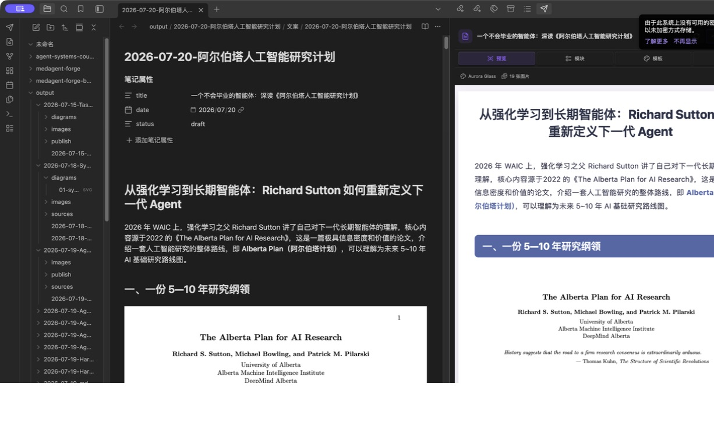
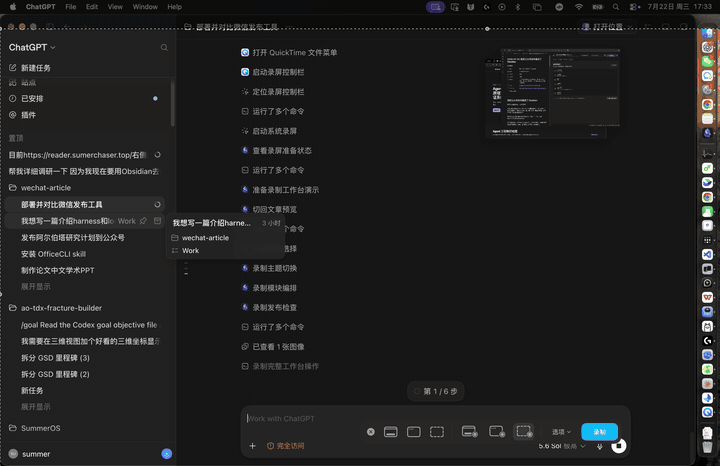
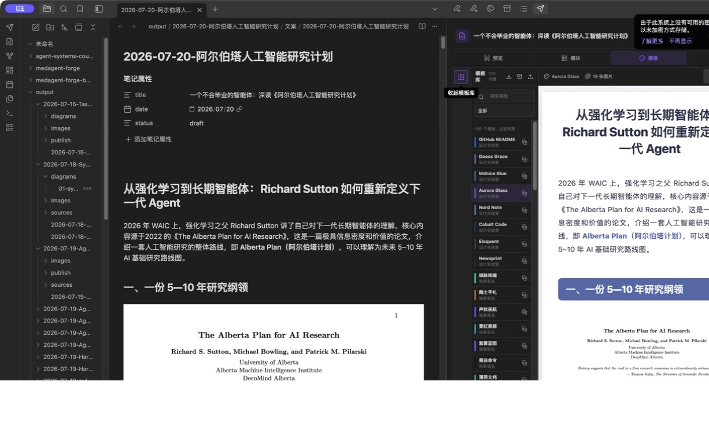
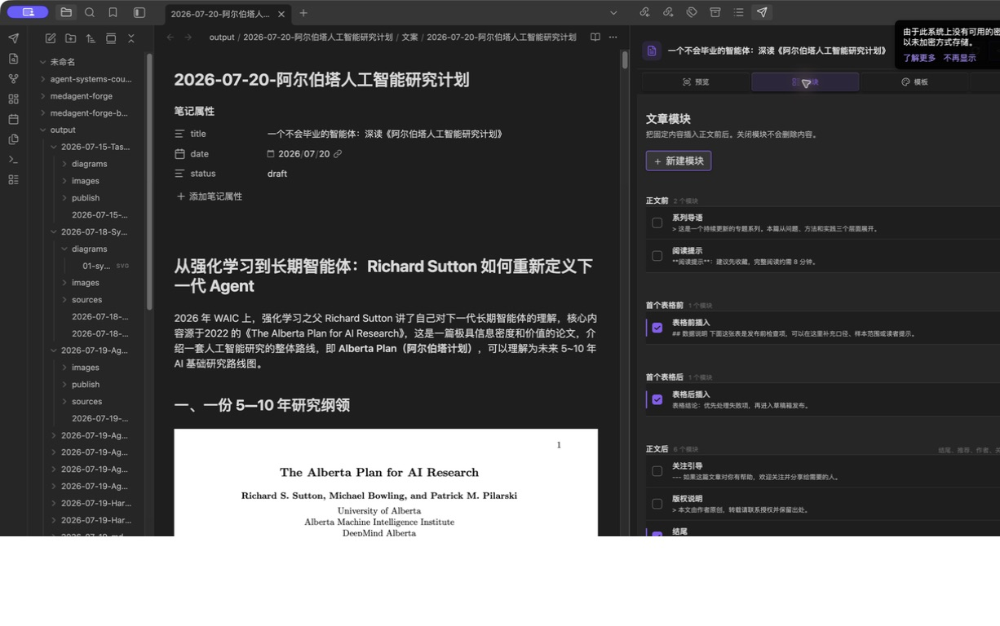
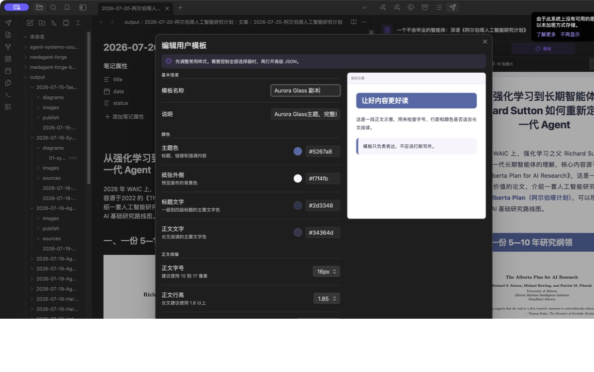

# WeChat Obsidian Publisher

[简体中文](README.md) | [English](README_EN.md)

Preview, compose, style, and publish WeChat Official Account drafts without leaving Obsidian.





[Watch the MP4 demo](docs/demo/workbench-v021.mp4)

<details>
<summary>View the template, module, and visual editor panels</summary>







</details>

## What it does

- Live-preview the active Markdown note in a dedicated side workbench, with desktop and mobile widths.
- Ship 129 selectable templates: preserve the 100-entry md2wechat-publisher catalog and add 40 traceable source-original themes. Seventeen same-ID token approximations are replaced by their original CSS or style objects rather than duplicated.
- Include all 12 Wenyan themes as original CSS, preserving Pie, Maize, Mint, Toutiao, inline SVG marks, and source heading structure while keeping body copy, lists, quotes, and tables left aligned.
- Group the 40 source-original themes as Mopai, WeMD, NeuraPress, and Doocs. Dark or high-impact themes are marked for short-form use so they do not displace long-form defaults.
- Keep the article visible while choosing a theme from a compact left-side rail.
- Compose nine module types: intro, before first table, after first table, ending, recommendations, author bio, follow card, copyright notice, and custom content.
- Add, edit, enable, delete, and reorder modules. Table modules are inserted around the first Markdown table.
- Duplicate any built-in template into an editable user template.
- Edit common colors, typography, font size, and line height visually, with advanced JSON available when needed.
- Import a single template, an array, or a complete template bundle from JSON; export the active template or all user templates.
- Render code blocks, KaTeX formulas, Mermaid diagrams, tables, and local Obsidian images.
- Upload body images, upload a permanent cover asset, then create or update a WeChat draft.
- Read the draft back through `draft/get` and only report success after the title and body pass verification.
- Import an existing Wenyan publishing account and move the AppSecret into Obsidian SecretStorage immediately.

## Architecture and Wenyan Core

This plugin has no runtime or build dependency on `@wenyan-md/core`. Its renderer follows a staged architecture inspired by Wenyan Core while implementing the pipeline independently:

```text
Markdown parsing → structural enrichment → theme token compilation → image rewriting → WeChat draft
```

“Wenyan Original” means the plugin vendors the original Wenyan Core theme CSS. It does not execute Wenyan Core at runtime. See [THIRD_PARTY_NOTICES.md](THIRD_PARTY_NOTICES.md) for attribution.

## Installation

The project is currently distributed through GitHub source and releases; it is not yet listed in the Obsidian Community plugin directory.

### Build from source

```bash
npm install
npm run check
```

Copy these files into `.obsidian/plugins/wechat-obsidian-publisher/` inside your vault:

```text
main.js
manifest.json
styles.css
```

Then enable `WeChat Obsidian Publisher` under Obsidian's Community plugins settings.

## Quick setup

1. Open the plugin settings.
2. If you already use `wechat-wenyan-publish`, choose **Secure import**.
3. Otherwise, enter the Official Account AppID and AppSecret manually.
4. Set a default author and cover, or override them per article in frontmatter.
5. Select the send icon in the left ribbon to open the publisher workbench.

The connection check only requests an access token. It does not create or modify a draft. If WeChat returns error `40164`, the settings page extracts the rejected public IPv4 and provides a copy button, the exact whitelist menu path, and a link to the WeChat Developer Platform. The same actionable card opens automatically when publishing is blocked by the whitelist.

## Article metadata

```yaml
---
title: Article title
author: Author name
digest: Summary within 120 Chinese characters
cover: images/cover.png
source_url: https://example.com/original
---
```

If `cover` is omitted, the first body image is used. The first publish creates a draft; publishing the same note again updates the associated draft.

## Custom templates

Built-in templates are immutable. In the **Templates** panel, select the duplicate icon to create a user-owned copy and open the editor. Use the visual controls for common typography and color changes, then switch to advanced JSON for exact control.

```json
{
  "id": "custom-example",
  "name": "My template",
  "description": "A custom publishing style",
  "source": "custom",
  "group": "User templates",
  "sourceLabel": "User template",
  "license": "user-defined",
  "tags": ["user-template"],
  "accent": "#356348",
  "canvas": "#f3f0e9",
  "tokens": {
    "variant": "custom",
    "accent": "#356348",
    "accentSoft": "#9ab69f",
    "tint": "#eef5ef",
    "heading": "#1d3326",
    "body": "#26342d",
    "link": "#356348",
    "strong": "#356348"
  },
  "styles": {
    "body": {
      "fontSize": "16px",
      "lineHeight": "1.85"
    },
    "h2": {
      "color": "#ffffff",
      "backgroundColor": "#356348"
    }
  }
}
```

On save and import, the plugin filters selectors, CSS properties, and external resources that are unsuitable for WeChat inline HTML. User templates live in the current vault's plugin settings and can be exported as portable JSON.

## Content modules

Modules can be inserted before the body, before the first table, after the first table, or after the body. Every module is written in Markdown and rendered through the active theme, so headings, lists, links, quotes, and images remain visually consistent.

Upgrades preserve existing modules, enabled states, and user templates while adding newly introduced built-in module definitions.

## Publishing safety

- The AppSecret is never committed to the repository or included in notifications and error logs.
- The plugin stores the AppSecret through Obsidian `SecretStorage`; `data.json` only keeps an `obsidian-secret:` reference and is restricted to `0600` permissions.
- Every real draft submission requires a confirmation dialog.
- The plugin calls draft APIs only. It never calls a mass-send endpoint.
- A draft is not reported as successful until `draft/get` read-back verification passes.

## Known limitations

- Desktop Obsidian only.
- The plugin creates or updates drafts; final review and mass sending remain in the WeChat admin console.
- Native WeChat components such as videos, polls, and Mini Program cards still need to be added in the official editor.
- Whether `SecretStorage` receives system-level encryption depends on the availability of the current operating system keychain. The plugin reports the actual status.

## Development

```bash
npm run dev
npm run test
npm run build
```

Licensed under the MIT License.
