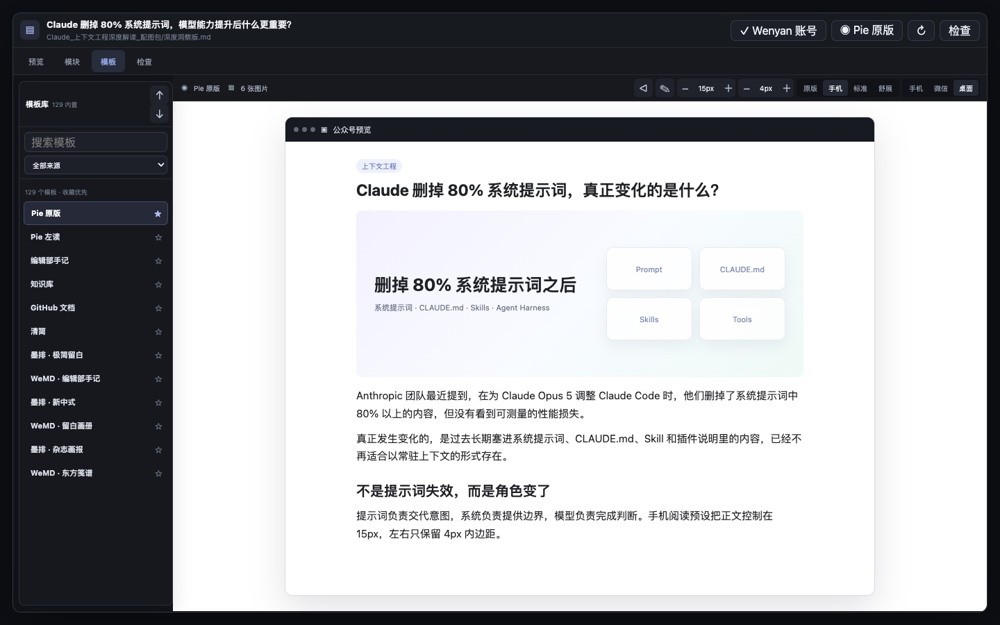
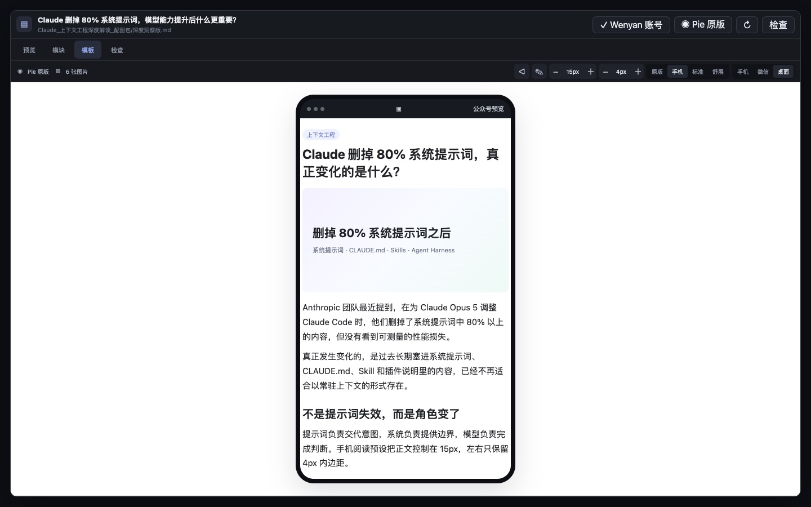

# WeChat Obsidian Publisher

[简体中文](README.md)

Format, preview, and publish WeChat Official Account drafts without leaving Obsidian. Version `0.2.9` tightens phone reading density with `15px` left-aligned body text and `4px` horizontal padding. Templates now use a text-only rail, controls live in the top bar, and the preview stays white without floating overlays.





## Highlights

- Preview the active Markdown note in a dedicated side workbench with phone, WeChat article, or desktop framing.
- Choose from 129 built-in templates, including the MD2 catalog, all 12 original Wenyan themes, and traceable open-source themes. Body copy, lists, quotes, and tables use a left-aligned reading baseline.
- Search, filter, favorite, import, and export templates from a translucent left rail while the article stays visible. Favorites are pinned first.
- Every template row shows only its name and three real palette swatches. Source attribution and the accent HEX remain available in the hover tooltip, without a fake article thumbnail.
- Duplicate any built-in template into a user template, edit colors, typography, font size, and line height, or import and export full JSON.
- Compose nine before-and-after content modules: intro, before table, after table, ending, recommendations, author bio, follow card, copyright notice, and custom content.
- Add, edit, enable, delete, and reorder modules. Table modules are placed around the first Markdown table.
- Render tables, highlighted code, KaTeX, Mermaid, local Obsidian images, and regular Markdown images.
- Upload body images and a cover, then create or update a WeChat draft. Reused images upload once and body-image uploads use bounded concurrency.
- Read the draft back through `draft/get`. The plugin does not report success if the title, structure, or inline styles differ from the preview.

## Phone Reading and Preview Parity

Templates without an explicit layout setting use the **Phone Reading** preset: `15px` body text, `1.72` line height, `10px` paragraph spacing, `20px` heading space, `0px` vertical padding, and `4px` horizontal padding. Those values are written as inline WeChat HTML, not borrowed from Obsidian preview CSS, so the preview and the submitted draft share the same styling rules.

There is no separate layout modal. Adjust the current template directly on the preview:

- Use the upper-right controls for Source, Phone, Standard, or Relaxed reading presets
- Switch the upper-right frame between Phone, WeChat, and Desktop
- Decrease, inspect, or increase the body font size in the top control bar
- Decrease, inspect, or increase article padding in the top control bar

**Source Theme** preserves the upstream layout. It is useful for source fidelity but can restore wider web-oriented margins.

The font and spacing controls live in the top bar, so opening the template library cannot make them cover the phone frame or article. Device chrome only simulates the reading context and is never included in the submitted article. The frame contains the same fully prepared HTML that is sent to WeChat. After draft creation, the plugin also reads the result back through `draft/get` and compares the title, structure, and inline styles.

## Relationship to Wenyan Core

The plugin does not depend on or run `@wenyan-md/core`. It independently implements Markdown parsing, structural enrichment, template compilation, image preparation, and WeChat draft publishing. "Wenyan Original" means that the corresponding source theme CSS is bundled to preserve details such as Pie heading decorations. See [THIRD_PARTY_NOTICES.md](THIRD_PARTY_NOTICES.md) for attribution.

## Installation

The plugin is currently distributed through GitHub source or releases. It is not yet listed in the Obsidian Community plugin directory.

### Build from source

```bash
npm install
npm run check
```

Copy these files to `.obsidian/plugins/wechat-obsidian-publisher/` inside your vault:

```text
main.js
manifest.json
styles.css
```

Then enable **WeChat Obsidian Publisher** under Obsidian Community plugins.

## Quick Start

1. Add an Official Account in plugin settings, or securely import it from `wechat-wenyan-publish`.
2. Set a default author and cover. Individual notes can override both in frontmatter.
3. Use the send icon in the left ribbon to open the publisher workbench.
4. Pick a template from the rail. Use the upper-right controls to tune font size, article padding, reading mode, and device frame.
5. On the **Check** tab, make sure the account, cover, images, and draft-parity preview pass before creating or updating a draft.

Connection testing only requests an access token. It never creates or changes a draft. When WeChat returns `40164`, the settings page extracts the rejected IPv4 and offers a copy action, the whitelist menu path, and a direct entry to the WeChat Developer Platform.

## Article Metadata

```yaml
---
title: Article title
author: Author name
digest: Summary within 120 Chinese characters
cover: images/cover.png
source_url: https://example.com/original
---
```

When `cover` is omitted, the first body image is used. The first publish creates a draft. A later publish of the same note updates the associated draft.

## User Templates

Built-in templates are immutable. Open **Templates**, choose **Duplicate and edit**, then edit the copied user template. The visual editor covers common font and color changes. Open advanced JSON for precise control.

Imports accept one template, an array of templates, or an exported template bundle. Save and import filter selectors, CSS properties, and external resources that are unsuitable for WeChat inline HTML. User templates live in the current vault settings; favorites and template-specific layout settings stay with the template.

```json
{
  "id": "custom-example",
  "name": "My template",
  "description": "A custom template for long-form reading",
  "source": "custom",
  "group": "User templates",
  "sourceLabel": "User template",
  "license": "user-defined",
  "tags": ["user-template"],
  "accent": "#356348",
  "canvas": "#f3f0e9",
  "tokens": {
    "variant": "custom",
    "accent": "#356348",
    "accentSoft": "#9ab69f",
    "tint": "#eef5ef",
    "heading": "#1d3326",
    "body": "#26342d",
    "link": "#356348",
    "strong": "#356348"
  },
  "styles": {
    "body": { "fontSize": "16px", "lineHeight": "1.75" },
    "h2": { "color": "#ffffff", "backgroundColor": "#356348" }
  }
}
```

## Safety and Limits

- AppSecrets are stored through Obsidian `SecretStorage`. `data.json` retains only a reference and uses `0600` permissions. The value is read back after storage to confirm persistence.
- AppSecrets are never written to the repository, notifications, or error logs.
- Every real draft submission asks for confirmation.
- The plugin only calls draft APIs. It never calls a mass-send endpoint.
- Desktop Obsidian only. Native WeChat features such as video, polls, and Mini Program cards still need to be added in the WeChat admin editor.

## Development

```bash
npm run dev
npm run test
npm run build
npm run check
```

License: [MIT](LICENSE).
